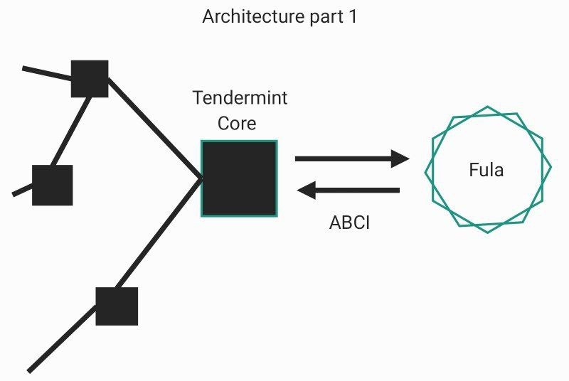
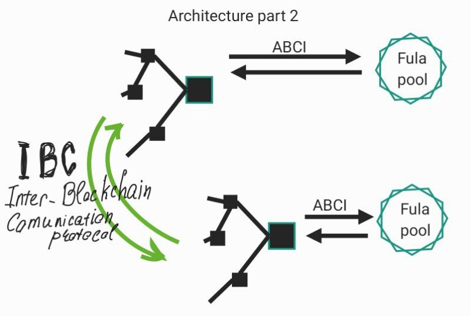

# Integrate tendermint-core because of BFT(Byzantine Fault Tolerance)

The goal is to explore the possibilities of using a **tendermint-core** that provides BFT consensus.

## About Tendermint-Core

Tendermint-Core is **Byzantine Fault Tolerant (BFT)** middleware that takes a state transition machine - written in any programming language - and securely replicates it on many machines.

Tendermint consists of two chief technical components:
- a blockchain consensus engine;
- and a generic application interface;

The consensus engine, called **Tendermint Core**, ensures that the same transactions are recorded on every machine in the same order.

The **application interface**, called the Application BlockChain Interface (ABCI), enables the transactions to be processed in any programming language.

**Useful links**:
- [Tendermint-Core documentation](https://docs.tendermint.com/v0.34/)
- [GitHub Tendermint repo](https://github.com/tendermint/tendermint)

## Options Considered
### 1. Use tendermint-core as a private blockchain.

Tendermint Core uses Application Blockchain Interface (ABCI) for communication.

The first option is to connect the Tendermint blockchain to Fula and accompany each event in the Fula network with a Tendermint transaction.

An example of the **transaction verification code** can be viewed at the [link](https://docs.tendermint.com/v0.34/tutorials/go.html#_1-3-1-checktx).

It is also possible to use a separate Tendermint blockchain core for each Fula pool.

The [**Inter-Blockchain Communication(IBC) protocol**](https://ibc.cosmos.network/) is provided for the communication of individual blockchains.
Personalizing your blockchain for each pool will make it possible to split the blockchain branches and have several small blocks,
instead of one large synchronization, which can later create delays in the validation of transactions.

### 2. Use only tendermint consensus. (Borrow the BFT consensus implementation approach.)

The option of borrowing the implementation of consensus from Tendermint was also considered.

Since the use of the consensus implementation itself is not provided by the Tendermint (is not a separate library).

[Here](https://github.com/tendermint/tendermint/tree/main/consensus) you can see how the BFT consensus is implemented in the Tendermint sources.

Tendermint consensus state was developed specifically for the tendermint blockchain, and to do something similar,
it is necessary either to change the approach of communication and the state of FULA nodes.
https://github.com/tendermint/tendermint/blob/main/consensus/state.go

### 3. Find an open library that will make it possible to easily integrate BFT consensus.

1- https://github.com/aleph-zero-foundation/consensus-go

2- https://github.com/nspcc-dev/dbft

3- https://github.com/SmartBFT-Go/consensus

4- https://github.com/dedis/cothority/tree/main/byzcoinx

## Conclusion

Chosen Option: **3 Find an open library**

## Pros and Cons of each Options

Option [1. Use tendermint-core as a private blockchain](#1-use-tendermint-core-as-a-private-blockchain)

- Good, because already implement BFT consensus, easy to use

- Bad, because it is a full-fledged blockchain that requires every state change in the Full network to be declared as a transaction.

Option [2. Use only tendermint consensus. (Borrow the BFT consensus implementation approach.)
](#2-use-only-tendermint-consensus-borrow-the-bft-consensus-implementation-approach)

- Good, because ready implementation of BFT

- Bad, because implementation of consensus is sharpened under the state of the Tendermint blockchain. Requires transactionality.

Option [3. Use tendermint-core as a private blockchain](#1-use-tendermint-core-as-a-private-blockchain)

- Good, because easy to use

- Bad, because You need to choose the best one.
  Conduct at least simple tests.
  Dependency on an external library.
